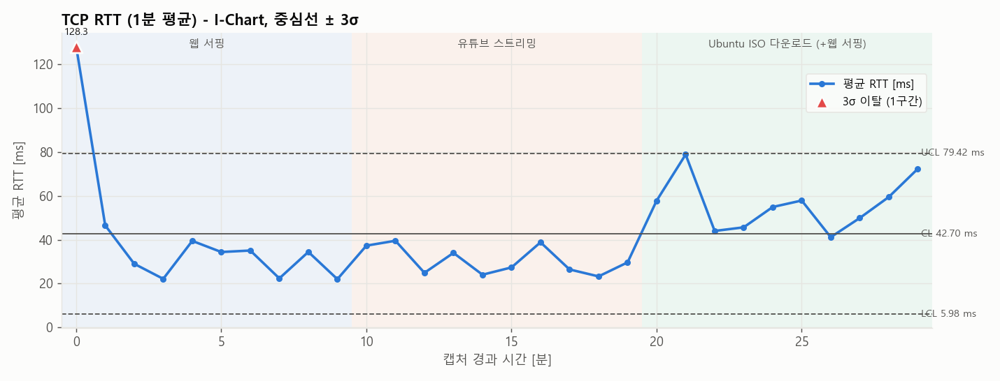
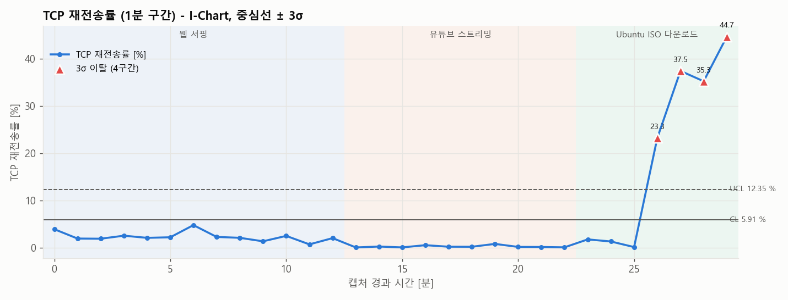
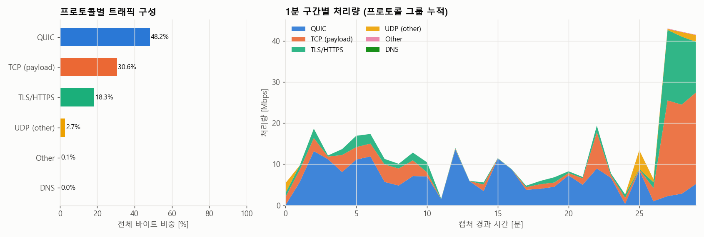
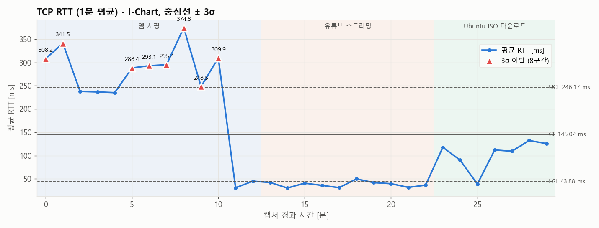

# network-traffic-analytics

**홈 네트워크 트래픽 품질 지표(RTT · TCP 재전송률 · DNS 응답시간 · 처리량)를 tshark + Python 으로 1분 단위 집계하고,
SPC I-Chart(중심선 + 3σ)로 품질 이상 구간을 자동 검출하는 파이프라인**

> 데이터네트워크 수업의 Wireshark 실습(HTTP / DNS / TCP 패킷 분석)을 개인 프로젝트로 확장한 것이다.
> 수업에서 패킷 하나를 읽는 실습과 실제 운용에서 수백만 패킷을 다루는 일 사이의 간격이 궁금해 시작했다.
> 수업에서는 패킷 하나하나를 GUI 로 읽었다면, 여기서는 **30분치 트래픽(183만 패킷)을 통째로 시계열 지표로 바꾸고
> "정상 범위"를 통계적으로 정의해 이상 구간을 자동으로 찾는 것**이 목표다.
> 관리도(I-Chart) 기법은 반도체 식각 공정 실습에서 사용했던 것
> ([etch-doe-optimizer/src/spc.py](https://github.com/yoontf0/etch-doe-optimizer/blob/main/src/spc.py))을
> 네트워크 운용 데이터에 그대로 재적용했다.

> ⚠️ 이 저장소에는 **raw pcap 과 패킷 단위 CSV 를 포함하지 않는다** (개인 트래픽 - IP, 방문 사이트 정보 포함).
> `results/` 에는 1분 단위 집계값과 그래프만 있으며, 모든 IP 는 `192.168.x.x` 형식으로 마스킹되어 있다.
> 아래 수치는 모두 실측값 그대로이며, 측정 도구의 한계로 신뢰할 수 없는 값은 그렇다고 명시했다.

---

## 1. 배경: 수업 실습 → 개인 확장

| | 수업 실습 (Kurose & Ross Wireshark Lab) | 이 프로젝트 |
|---|---|---|
| 대상 | 단일 HTTP 요청, DNS 질의 1회, TCP 연결 1개 | 30분 동안의 전체 홈 트래픽 (183만 패킷, 2.1 GB) |
| 도구 | Wireshark GUI 로 필드 읽기 | tshark CLI 필드 추출 → pandas 집계 → matplotlib |
| 질문 | "SYN 의 seq 번호는?", "DNS 응답 포트는?" | "품질이 평소보다 나빠진 구간은 언제이고 왜인가?" |
| 판단 기준 | 없음 (관찰) | I-Chart 관리한계 (CL + 3σ) 로 정량 판정 |

## 2. 방법론

### 2.1 캡처
- 환경: 노트북 1대, 홈 Wi-Fi (링크 144 Mbps), 유선/VPN 없음, 클라우드 동기화(OneDrive · Google Drive) 종료
- `dumpcap -i Wi-Fi -p -f "host <내 IP>" -B 512 -a duration:1800 -w capture.pcapng` ([scripts/capture_v2.ps1](scripts/capture_v2.ps1))
  - `-p` (non-promiscuous) + `host` 캡처 필터로 **내 기기 트래픽만** 수집
  - 커널 버퍼 512 MB, OneDrive 밖 로컬 디스크 저장 → **캡처 드롭 0** (1차 캡처에서 tshark + OneDrive 폴더 저장 시 7.9% 드롭이 나서 바꿈)
- 트래픽 패턴이 다양하게 나오도록 3가지 활동을 10분씩 진행 ([docs/capture_plan.md](docs/capture_plan.md), 실제 로그 [docs/activity_log.md](docs/activity_log.md))

| 경과 시간 | 활동 |
|---|---|
| 0 ~ 10분 | 웹 서핑 (뉴스 · 쇼핑 · 위키 · GitHub 등 여러 사이트) |
| 10 ~ 20분 | 유튜브 스트리밍 (1080p+, 영상 전환 + 재생 위치 점프) |
| 20 ~ 30분 | Ubuntu ISO 다운로드 + 웹 서핑 병행 |

### 2.2 필드 추출 (tshark)
```
tshark -r capture.pcapng -n -T fields -E header=y -E separator=, \
  -e frame.time_epoch -e ip.src -e ip.dst -e _ws.col.Protocol -e frame.len -e tcp.stream \
  -e tcp.analysis.ack_rtt -e tcp.analysis.retransmission -e tcp.analysis.fast_retransmission \
  -e tcp.analysis.spurious_retransmission -e tcp.analysis.lost_segment -e tcp.analysis.duplicate_ack \
  -e dns.time -e dns.flags.response ...
```

### 2.3 1분 구간(bin) 집계 ([src/aggregate.py](src/aggregate.py))

| 지표 | 정의 | 주의한 점 |
|---|---|---|
| **RTT** [ms] | `tcp.analysis.ack_rtt` 의 1분 평균 / p95 / 최대 | **서버 → 내 호스트 방향 ACK 만 사용.** 내 호스트가 보낸 ACK 의 ack_rtt 는 delayed-ACK 지연이 섞여 네트워크 RTT 가 아니다 (테스트 pcap 에서 실제로 301 ms 로 찍히는 것을 확인). 3 s 초과 표본은 RTO 가 이미 발생했을 시간이므로 무효 처리, 표본 5개 미만 구간은 결측 |
| **재전송률** [%] | (retransmission + fast retransmission) / 전체 TCP 세그먼트 × 100 | spurious retransmission 은 실제 손실이 아니므로 분리. `lost_segment`, `duplicate_ack` 도 함께 집계해 캡처 품질 판단에 사용 |
| **DNS 응답시간** [ms] | `dns.time` (query → response) 평균 / 최대 | 응답 패킷 기준 |
| **처리량** [Mbps] | Σ frame.len × 8 / 60 s | 다운 / 업 방향 분리 |

### 2.4 I-Chart (개별값 관리도) ([src/spc.py](src/spc.py))
- 각 1분 구간값을 하나의 개별 관측치로 보고, 이동범위(Moving Range)로 σ 를 추정
  - σ̂ = MR̄ / d₂ (n=2 → d₂ = 1.128), **UCL = CL + 3σ̂ = CL + 2.66·MR̄**, LCL 은 0 에서 절단
- 반도체 SPC 와 동일한 공식. 차이는 "로트별 식각률" 대신 "1분별 RTT / 재전송률" 이 들어간다는 것뿐
- RTT · 재전송률은 낮을수록 좋은 지표이므로 **UCL 초과만 이상(out-of-control)** 으로 판정 (LCL 아래 = 평소보다 좋음)
- 이탈 구간은 같은 시간대의 처리량 · 상대 서버 · 활동 로그와 대조해 원인을 추정

## 3. 결과 (2차 캡처, 캡처 드롭 0)

### 3.1 데이터 개요

| 항목 | 값 |
|---|---|
| 캡처 시간 | 1,800 s (30분, 1분 구간 30개) |
| 총 패킷 / 용량 | 1,831,563 패킷 / 2.09 GB (캡처 드롭 0) |
| 처리량 | 평균 9.3 Mbps, 1분 최대 47.4 Mbps |
| TCP 세그먼트 / RTT 표본 / DNS 응답 | 1,068,025 / 27,638 / 2,325 |
| 프로토콜 구성 (바이트) | TLS/HTTPS 38.9 %, QUIC 33.0 %, TCP 21.6 %, UDP 6.2 %, DNS 0.03 % |

### 3.2 그래프

**① RTT I-Chart** — CL 42.7 ms, UCL 79.4 ms, 이탈 **1구간** (0분)


**② TCP 재전송률 I-Chart** — CL 3.29 %, UCL 13.0 %, 이탈 **1구간** (10분)


**③ 프로토콜별 트래픽 구성** — 유튜브 구간은 QUIC(UDP/443), 다운로드 구간은 TLS/TCP 가 지배


### 3.3 핵심 수치

| 지표 | 전체 30분 | 웹 서핑 (0~10분) | 유튜브 (10~20분) | 다운로드+웹 (20~30분) |
|---|---|---|---|---|
| RTT 평균 / 중앙값 / p95 [ms] | **46.9 / 18.5 / 195.3** | 41.4 (1분 평균 기준) | 30.5 | 56.2 |
| RTT 1분 평균 최대 [ms] | 128.3 | 128.3 | 39.5 | 78.9 |
| TCP 재전송률 [%] | **9.72** | 0.35 | 15.63 (10분 구간 버스트 제외 시 0.54) | 9.30 |
| 재전송률 1분 최대 [%] | 27.1 | 0.89 | 27.11 | 12.25 |
| DNS 응답 평균 / 중앙값 / p95 [ms] | **21.0 / 14.3 / 48.6** | 14.9 | 20.2 | 24.1 |
| 처리량 평균 / 최대 [Mbps] | 9.3 / 47.4 | 5.7 / 12.1 | 5.8 / 25.4 | 16.4 / 47.4 |

### 3.4 3σ 이탈 구간과 원인 추정

| # | 지표 | 구간 | 값 | 원인 추정 (패킷 데이터로 확인한 사실) |
|---|---|---|---|---|
| 1 | RTT | 0~1분 | 1분 평균 128.3 ms (UCL 79.4) | **구성(composition) 효과.** 이 1분의 RTT 표본 1,556개 중 89 %가 미국 소재 서버(작업에 사용한 AI 어시스턴트 앱의 상시 세션, RTT ≈ 134 ms)와의 ACK 였다. 아직 웹 서핑 트래픽이 거의 없어 해외 세션이 평균을 지배한 것으로, **국내 경로의 품질 저하가 아니다.** 같은 서버를 제외한 나머지 표본 평균은 88.6 ms, 이후 구간에서 이 서버 비중이 4~30 %로 내려가면 RTT 평균도 20~40 ms 로 안정 |
| 2 | 재전송률 | 10~11분 | 27.1 % (UCL 13.0) | 유튜브 시작 직후 1분 동안 Ubuntu 미러 서버에서 **110 MB TCP 버스트 다운로드**(25 Mbps)가 발생, 해당 흐름의 세그먼트 37 %가 재전송 플래그. 활동 로그에는 없던 전송으로, 사용자가 다운로드 링크를 미리 눌렀다가 취소한 것으로 확인(패킷 데이터에서 먼저 발견 후 사용자에게 확인). 같은 서버로부터의 다운로드는 1차 캡처에서도 동일하게 37 % 재전송률을 보여 **이 서버 경로 고유의 현상**으로 보인다 |
| - | 재전송률 | 20~26분 (UCL 미만) | 7~12 % | Ubuntu ISO 본 다운로드(최대 46.5 Mbps). 20초 표본을 세그먼트 단위로 추적한 결과 재전송 플래그의 75 %는 **이미 수신한 데이터의 중복**(원본 대비 283~395 ms 후 도착, IP ID 상이 → 서버 측 재전송)이고 25 %는 실제 손실 구간 채움. 즉 고속 다운로드 중 실제 손실과 서버 RTO 성 재전송이 함께 발생. 다만 관리한계(13.0 %)가 10분 구간 스파이크로 넓어져 3σ 이탈로는 잡히지 않음 → 3.5 절 |

### 3.5 기준선을 바꾸면 결과가 달라진다 (Phase I / Phase II)
위 관리한계는 30분 전체에서 추정한 것(Phase I, 자기 자신 대비)이다. 실제 관제라면 **정상 기간의 기준선**을 먼저 확보하고 그 한계를 새 데이터에 적용한다(Phase II).
0~20분(웹 서핑 + 유튜브)을 기준선으로 두면:

| 지표 | Phase I (전체) UCL | Phase II (0~20분 기준) UCL | Phase II 이탈 구간 |
|---|---|---|---|
| RTT | 79.4 ms | 71.6 ms | 0, 21, 29분 (3구간) |
| 재전송률 | 13.0 % | 9.55 % | 10, 22, 25, 28분 (4구간) |

다운로드 구간의 재전송률 상승(9~12 %)이 Phase II 에서는 이탈로 잡힌다. **관리한계는 "무엇을 정상으로 볼 것인가"의 선언**이며, 그 선택이 검출 결과를 좌우한다는 것이 이 프로젝트에서 얻은 가장 중요한 교훈이다.

## 4. 1차 캡처: 백그라운드 업로드가 만든 RTT 이상 (비교 사례)

같은 날 먼저 수행한 1차 캡처([results/run1_gdrive_upload/](results/run1_gdrive_upload/))에서는 사용자가 인지하지 못한 **Google Drive 백업 업로드(약 5.5 Mbps, 11분간 360 MB)** 가 함께 잡혔다.



| | 1차 (업로드 동시 진행) | 2차 (동기화 종료) |
|---|---|---|
| 웹 서핑 구간 RTT 평균 | **249.6 ms** | 41.4 ms |
| 웹 서핑 구간 DNS 응답 평균 | **166.9 ms** | 14.9 ms |
| RTT 3σ 이탈 | 8구간 (0~1, 5~10분) | 1구간 |

- 업링크가 포화되면 큐잉 지연(bufferbloat)으로 **모든 세션의 RTT 와 DNS 응답이 6~10배 느려진다.** 사용자가 체감하는 "인터넷이 느리다"의 흔한 원인이며, I-Chart 가 그 구간을 그대로 검출했다.
- 이 캡처는 tshark 로 캡처하며 OneDrive 폴더에 저장해 **7.9 % 캡처 드롭**이 났고, 그 결과 다운로드 구간의 재전송률이 37~45 %로 과대 산출됐다(원본을 놓치고 재전송본만 잡히면 재전송으로 플래그됨). 재전송률 40 %는 다운로드가 정상 속도(40 Mbps)로 진행된 사실과 모순되어 측정값 자체를 의심했고, 20초 구간을 세그먼트 단위로 추적해 재전송 플래그의 38 %가 캡처에 한 번도 없던 바이트임을 확인했다. **측정 도구 자체가 지표를 오염시킬 수 있다**는 것을 확인하고 2차에서 dumpcap + 대용량 버퍼 + 로컬 디스크로 바꿔 드롭 0 을 달성했다.

## 5. 한계와 다음 단계
- **표본 2회(각 30분)**: 관리한계가 캡처 자체에서 추정된 값이라 "평소 대비"가 아니라 "이 30분 대비"이다. 수일치 정상 데이터로 기준선을 만들고 Phase II 로 운용해야 한다.
- **RTT 평균은 상대 서버 구성에 민감**: 해외 세션 비중이 바뀌면 경로 품질이 그대로여도 평균이 움직인다(3.4 절 #1). 목적지 AS / 경로별 층화 관리도 또는 중앙값 기반 지표가 필요하다.
- **3σ 단일 규칙**: 서서히 나빠지는 추세(drift)는 잡지 못한다 → Western Electric rules, EWMA / CUSUM 관리도가 다음 단계.
- **단일 관측점**: 클라이언트에서 본 값이라 손실이 Wi-Fi 구간인지 ISP / 서버 구간인지 구분 못 한다. 3.4 절의 "서버 측 재전송"도 상향 ACK 손실인지 서버 RTO 설정 문제인지는 서버 측 데이터 없이 확정할 수 없다.
- **활동 의존성**: RTT · 재전송률의 분산은 사용자가 무엇을 했는지에 크게 좌우된다. 활동별 층화 관리도가 필요하다.

## 6. 실행 방법
```bash
pip install -r requirements.txt
# 1) 캡처 (Wireshark + Npcap 설치 필요)
.\scripts\capture_v2.ps1 -Minutes 30
# 2) 분석 (활동 구간 음영, 캡처 드롭 수, Phase II 기준선은 선택)
python run_pipeline.py --pcap <캡처파일>.pcapng --activities results/activities.json --dropped 0 --baseline 0-20
# 3) 테스트
python -m pytest -q tests
```

```
network-traffic-analytics/
├─ run_pipeline.py        # pcap → 추출 → 집계 → I-chart → 그래프/요약
├─ src/
│  ├─ extract.py          # tshark 필드 추출, CSV 로드, 호스트 IP 추정, RTT 유효성 필터
│  ├─ aggregate.py        # 1분 구간 지표 집계, 프로토콜 구성
│  ├─ spc.py              # I-Chart 관리한계 (Phase I / Phase II), 이탈 구간 검출
│  ├─ visualize.py        # 그래프 3장
│  └─ mask.py             # IP 마스킹
├─ scripts/               # capture.ps1 (tshark), capture_v2.ps1 (dumpcap, 드롭 0)
├─ tests/                 # SPC / 집계 단위 테스트 (pytest, 7개)
├─ docs/                  # 캡처 시나리오, 실제 활동 로그
└─ results/               # 2차 캡처 결과: 집계 CSV + 그래프 + summary.json (IP 마스킹)
   └─ run1_gdrive_upload/ # 1차 캡처 결과 (비교 사례)
   (captures/, data/ 는 .gitignore - raw 데이터 비공개)
```
